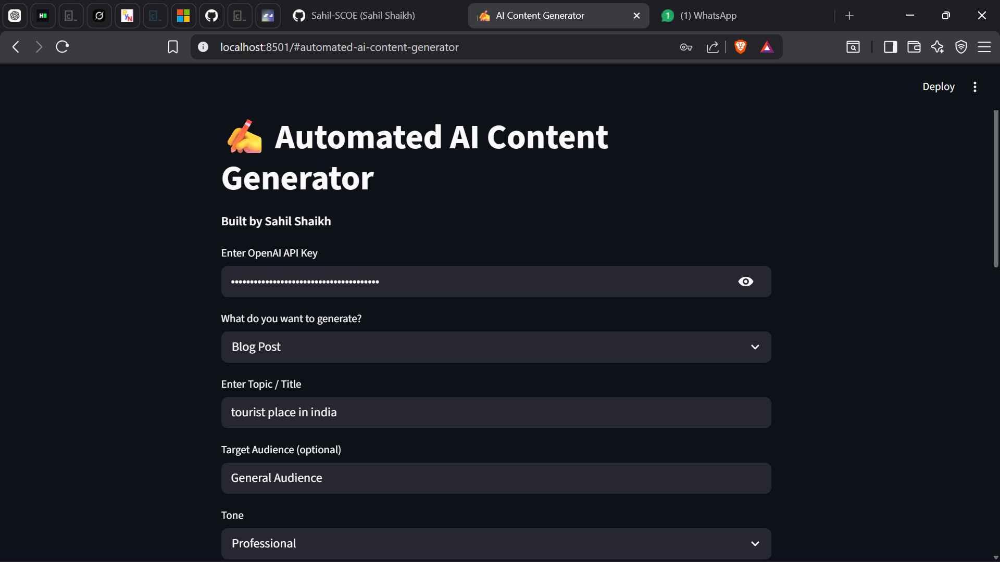

# ✍️ AI Content Generator

**Built by: Sahil Shaikh**

An Automated AI tool that generates high-quality content for Blog Posts, LinkedIn, YouTube, Twitter, etc. using OpenAI GPT.


## Features
- Generate Blog Posts, LinkedIn content, YouTube scripts, etc.
- Multiple content types and tones
- Fast and high-quality output

## Tech Stack
- Python
- OpenAI GPT-3.5-turbo
- Streamlit

## How to Run

```bash
git clone https://github.com/Sahil-SCOE/ai-content-generator.git
cd ai-content-generator
pip install -r requirements.txt
streamlit run app.py